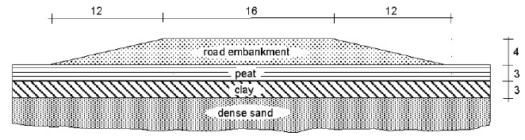
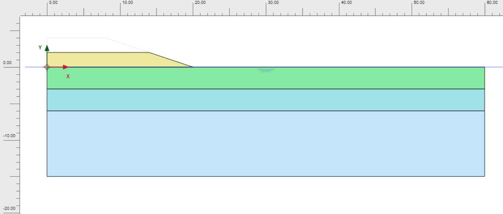
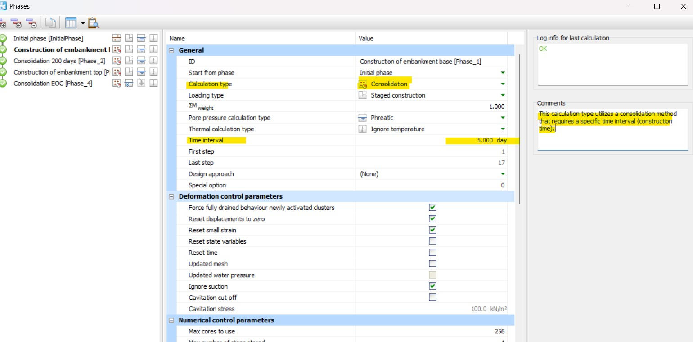

## Overview
*This practice was completed as part of a Bentley webinar on the use of PLAXIS, conducted during the COVID-19 pandemic in 2020*

The construction of an embankment on soft soil with a high groundwater table results in an increase in pore water pressure. 

Due to the undrained behaviour associated with rapid construction (approximately 5 days for both the base and embankment fill stages), the effective stress remains low. 

Therefore, intermediate consolidation periods are required to ensure safe construction.

During consolidation, the excess pore water pressures gradually dissipate, leading to an increase in effective stress and shear strength. 

This allows the embankment construction to proceed safely to the next stage.

*Figure 1. Situation of a road embankment on soft soil.*

## Construction phases in PLAXIS

The embankment construction consists of two stages: the base embankment and the top embankment, each requiring 5 days to complete.

Following the first construction stage, a 200-day consolidation period is introduced to allow the dissipation of excess pore water pressures generated during construction.

After the second construction stage, an additional consolidation phase is carried out to evaluate the final settlement of the embankment.

In this phase, the "Minimum Excess Pore Pressure" option is selected, and a stopping criterion of $P$-stop = 1 kPa is specified.

The analysis continues until the excess pore water pressures have essentially dissipated throughout the soil mass.

Consequently, a total of five calculation phases are required, including the initial phase.

## Phase 1: Construction of the embankment base

*Figure 2. Construction of the embankment base (Phase 1).*

*Figure 3. Calculation Type: Consolidation with time interval of 5 days for Phase 1.*

